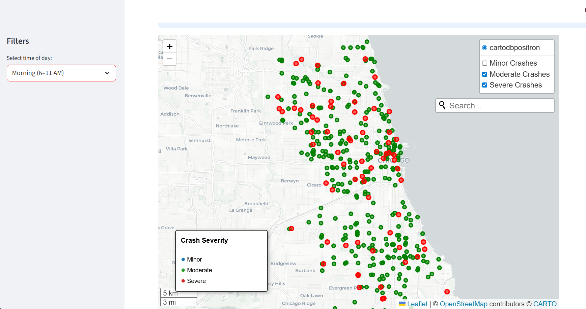
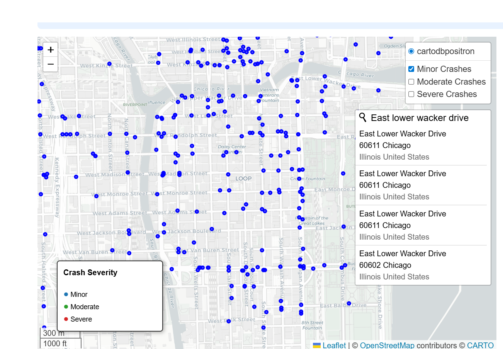
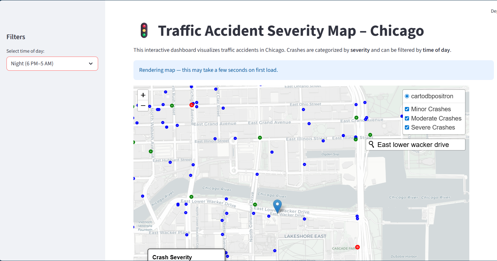
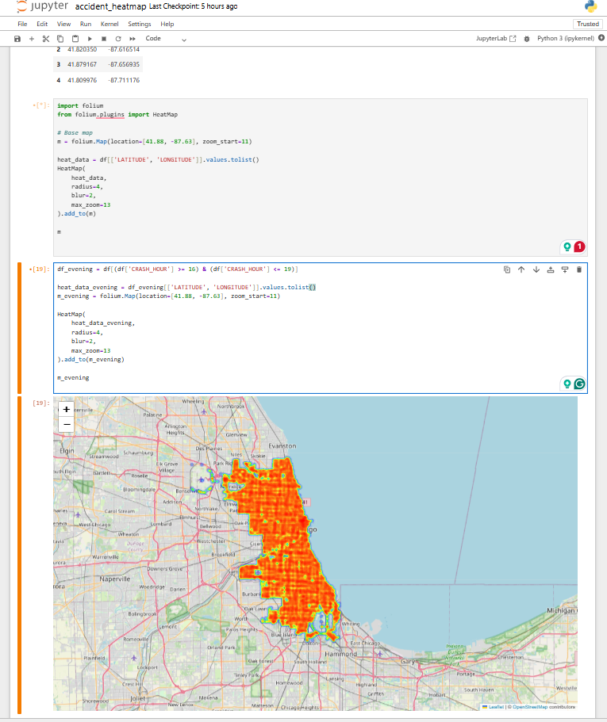
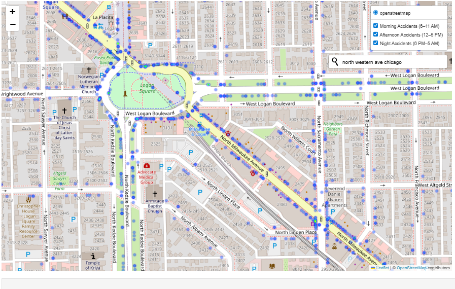

# Traffic Accident Severity Map — Chicago
 
An interactive geospatial dashboard that visualizes traffic accidents in Chicago, categorized by crash severity.
Built to help users explore where severe, moderate, and minor crashes occur across the city.

## Project Overview

Traffic accidents are not evenly distributed across a city. This project uses real Chicago crash data to:
1. Visualize accident locations on an interactive map
2. Categorize crashes by severity
3. Allow users to toggle severity layers

The goal is to make public safety data more accessible and easier to explore through visualization.

## Features

Interactive map centered on Chicago

1. Severity-based visualization
🔵 Minor crashes
🟢 Moderate crashes
🔴 Severe crashes
2. Layer controls to toggle severity levels
3. Performance-aware sampling for smooth rendering
4. Allows users to view crashes in accordance to the time it occured
5. Search by street or neighborhood

## How Severity Is Defined

Crash severity is derived from injury data:
Severe: Fatal or incapacitating injuries
Moderate: Non-incapacitating injuries
Minor: No reported injuries
This logic allows the visualization to reflect real-world impact rather than raw crash counts alone.

## Tech Stack

Python
Streamlit — web app framework
Folium — interactive maps (Leaflet.js)
Pandas — data cleaning & processing
streamlit-folium — Streamlit ↔ Folium integration

## Future Improvements

1. Inspect individual crashes through clickable popups feature
2. Crash clustering for large datasets
3. Additional analytics (hotspots, trends over time)
4. Deployment as a public web dashboard

## Data Source

Chicago Open Data Portal — Traffic Crash Records
(Data used for educational and visualization purposes)

## App Preview

## Author

Benedicta Nzekwe
Software Engineering & Data Science Enthusiast 
Focused on building technology for public safety and social impact.